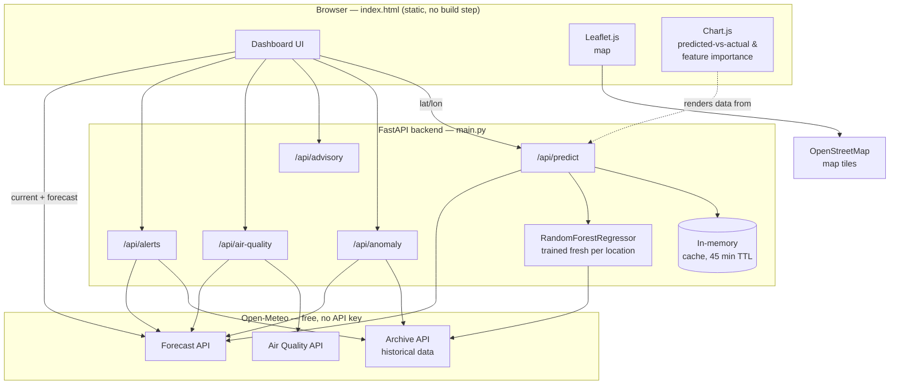
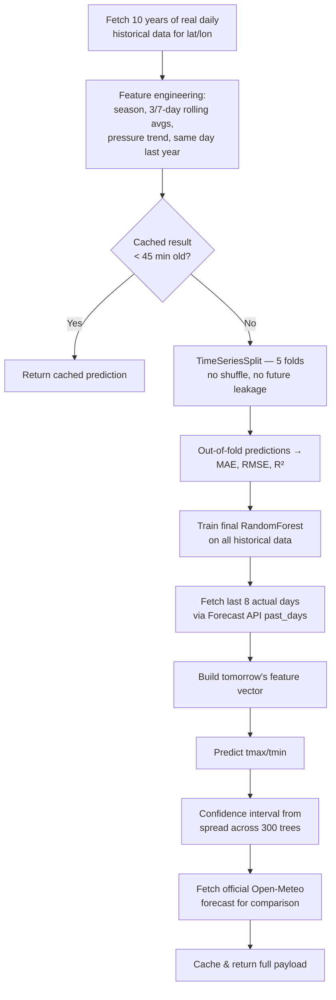
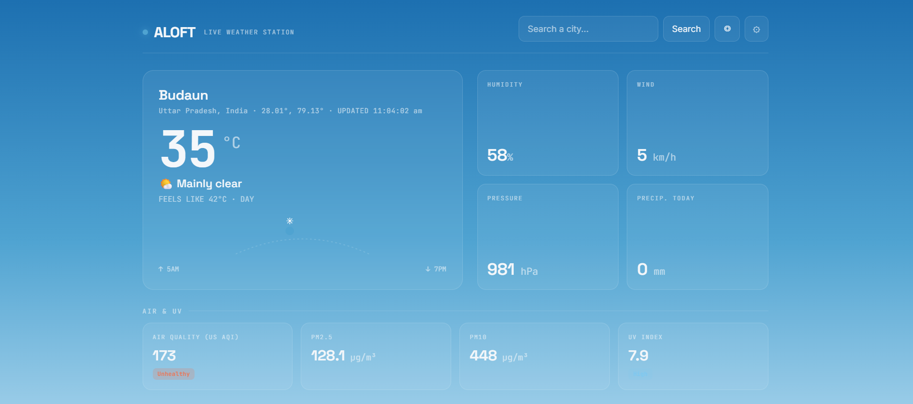
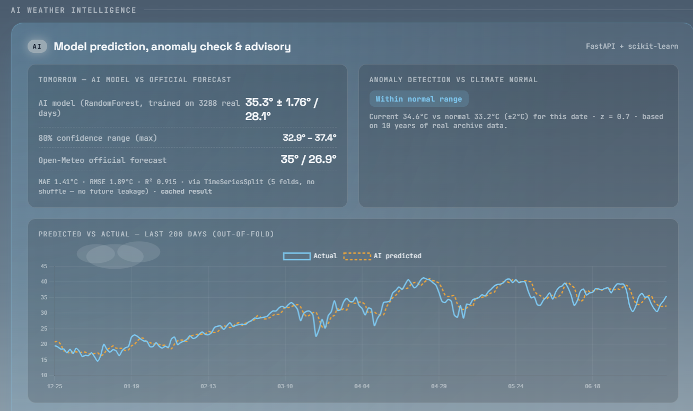

# Aloft — AI Weather Dashboard

Real weather data + a real, freshly-trained ML model — no fake numbers, no API key.

## What's real here

- **Live current/forecast weather** — Open-Meteo forecast API (frontend calls directly, no key).
- **AI prediction** — backend pulls 10 years of real historical data for the exact lat/lon from Open-Meteo's Archive API and trains a `RandomForestRegressor` (scikit-learn) *per request* to predict tomorrow's max/min temp across 12 features (season, recent temp/humidity/pressure/wind/radiation trends, pressure change, same day last year). Reports MAE/RMSE/R² from proper TimeSeriesSplit cross-validation and a confidence interval from the real spread across its trees — not marketing numbers.
- **Anomaly detection** — z-score of today's temperature against the true climate normal (mean/std over 10 years of real data for this day-of-year at this location). Flags heatwaves / cold snaps, not just "cloudy".
- **Advisory engine** — real heat-index formula (NOAA) + threshold rules → actionable health, clothing, wind, and irrigation guidance.

This solves an actual problem: a plain forecast tells you a number, but not whether that number is *normal* for where you live, nor what to *do* about it. This does both.

## Run the backend locally

```bash
cd weather-ai-backend
pip install -r requirements.txt
uvicorn main:app --reload --port 8000
```

Test it:
```
http://127.0.0.1:8000/api/predict?lat=28.37&lon=79.43
http://127.0.0.1:8000/api/anomaly?lat=28.37&lon=79.43
```

## Connect the frontend

Open `index.html` in your browser. Scroll to the **AI weather intelligence** panel and paste your backend URL (defaults to `http://127.0.0.1:8000` for local dev) into the "Backend URL" box, click Save. It's remembered via localStorage.

## Deploy (same flow as your other FastAPI projects)

**Render** (recommended, matches your Quiz Generator setup):
1. Push `weather-ai-backend/` to GitHub.
2. New → Web Service → connect repo.
3. Build command: `pip install -r requirements.txt`
4. Start command: `uvicorn main:app --host 0.0.0.0 --port $PORT`
5. Once live, copy the Render URL into the frontend's Backend URL field.

**Frontend**: push `index.html` to a repo and enable GitHub Pages — pure static file, no build step.

## API reference

| Endpoint | Purpose |
|---|---|
| `GET /api/climate-normal?lat=&lon=` | Historical mean/std temp for today's date at this location |
| `GET /api/predict?lat=&lon=` | AI prediction (tmax/tmin, confidence interval, MAE/RMSE/R², predicted-vs-actual history, feature importances) — cached 45 min per location |
| `GET /api/anomaly?lat=&lon=` | Z-score anomaly flag (heatwave/cold snap/normal) |
| `GET /api/advisory?temp=&humidity=&wind=&precipitation_prob=&weather_code=` | Health/clothing/activity advisory |
| `GET /api/air-quality?lat=&lon=` | US AQI, PM2.5, PM10, UV index (Open-Meteo Air Quality API) |
| `GET /api/alerts?lat=&lon=` | Data-driven alerts (heatwave/cold snap/wind/storm/rain) — **not** official government warnings, labeled as such |

## What's new in this version

- **TimeSeriesSplit cross-validation** (5 folds) instead of a single random holdout — this is the methodologically correct way to evaluate a time series model, since a random split would leak future data into training.
- **MAE, RMSE, R²** all reported from the same out-of-fold predictions.
- **Confidence intervals** on tomorrow's prediction, computed from the real spread of predictions across the RandomForest's 300 individual trees — not an assumed statistical distribution.
- **Predicted-vs-actual history** — the last ~200 out-of-fold predictions vs what actually happened, so you can see real model performance over time, not just one number.
- **In-memory caching** (45 min TTL per location) so repeat requests don't retrain from scratch.
- **Feature importance** — full ranked list of what the model actually weighs, shown as a bar chart in the dashboard.
- **Air quality & UV** via Open-Meteo's free Air Quality API.
- **Data-driven alerts** — clearly labeled as derived from open data, not an official meteorological warning.

## Notes on honesty

- The MAE reported by `/api/predict` is a real holdout evaluation on unseen days from that location's own historical data — not a marketing number.
- If a location has too little archive coverage, `/api/predict` returns a 422 rather than a guess.

## Project architecture



## Model workflow



## Screenshots


```markdown


```

To record a demo GIF on Windows: [ScreenToGif](https://www.screentogif.com/) (free) or [ShareX](https://getsharex.com/) both export directly to `.gif`. Save them into a `screenshots/` folder next to this README, then the links above will render automatically on GitHub.

## Limitations

- **Can't beat physics-based forecasting.** The AI model only sees this location's own historical pattern — it has no visibility into incoming weather systems, fronts, or storms the way Open-Meteo's official forecast (built on real numerical weather models) does. It's a complement to the official forecast, not a replacement.
- **Single-day-ahead only.** The model currently predicts tomorrow only; it doesn't extend to a 7-day AI forecast.
- **Retrains from scratch, not persisted.** Each new location trains a fresh model in memory; nothing is saved to disk or a database, so a server restart loses the cache (though it rebuilds automatically on the next request).
- **Archive coverage varies by location.** Remote or sparsely-monitored areas may have thinner historical records, which lowers model reliability there — the API returns a 422 rather than guessing if there's too little data.
- **Alerts are data-derived, not official.** The alerts endpoint flags statistical anomalies (heatwave/cold snap/high wind/storm codes) from open data — it is explicitly not a substitute for a government meteorological warning.
- **No authentication or rate limiting.** CORS is wide open (`*`) and there's no request throttling — fine for a personal/portfolio project, not production-ready as-is.
- **Map tile usage.** Uses OpenStreetMap's public tile server directly from the browser; under heavy traffic this could hit OSM's fair-use limits (fine for demo/personal use).

## Future improvements roadmap

- [ ] Multi-day AI forecast (extend beyond tomorrow to a full week)
- [ ] Persist trained models (disk or lightweight DB) instead of retraining per cache miss
- [ ] Try gradient boosting (XGBoost/LightGBM) alongside RandomForest and compare
- [ ] User accounts with saved favorite locations
- [ ] Integrate an official alerts source (e.g., a national weather service API) where available, alongside the current data-derived alerts
- [ ] Dockerize the backend for easier deployment
- [ ] Add automated tests (pytest) for the feature engineering and API endpoints
- [ ] CI/CD pipeline (GitHub Actions) for deploy-on-push
- [ ] Progressive Web App (installable, offline-capable shell)
- [ ] CSV/JSON export of prediction history
- [ ] Rate limiting and tightened CORS for production use
